# 飞书应用自动化配置流程分析

## 整体架构

```
┌─────────────────────────────────────────────────────────────────────────────┐
│                           飞书应用自动化配置流程                               │
├─────────────────────────────────────────────────────────────────────────────┤
│                                                                             │
│  ┌─────────┐    ┌─────────┐    ┌─────────┐    ┌─────────┐    ┌─────────┐  │
│  │  登录   │ -> │ 应用    │ -> │ 权限    │ -> │ 事件    │ -> │ 回调    │  │
│  │  检查   │    │ 管理    │    │ 配置    │    │ 订阅    │    │ 配置    │  │
│  └─────────┘    └─────────┘    └─────────┘    └─────────┘    └─────────┘  │
│                                   │              │                          │
│                                   v              v                          │
│                              ┌─────────┐   ┌─────────┐                      │
│                              │  版本   │   │ 长连接  │                      │
│                              │  发布   │   │  客户端 │                      │
│                              └─────────┘   └─────────┘                      │
└─────────────────────────────────────────────────────────────────────────────┘
```

## 详细流程图

```mermaid
flowchart TD
    subgraph 初始化
        A[打开飞书首页] --> B{检查登录状态}
        B -->|未登录| C[提示扫码登录]
        C --> D[程序退出]
        B -->|已登录| E[跳转开放平台]
    end

    subgraph 应用管理
        E --> F{检查应用是否存在}
        F -->|唯一匹配| G[自动选择应用]
        F -->|多个匹配| H[用户选择应用]
        F -->|未找到| I[创建新应用]
        H -->|选择已有| G
        H -->|创建新应用| I
        I --> J[is_new_app = True]
        G --> K[is_new_app = False]
    end

    subgraph 凭证获取
        J --> L[获取 App Secret]
        K --> L
        L --> M{is_new_app?}
    end

    subgraph 长连接_新应用
        M -->|是| N[启动长连接客户端]
        N --> O[等待6秒]
    end

    subgraph 能力配置
        M -->|否| P[跳转 capability 页面]
        O --> P
        P --> Q[添加机器人]
    end

    subgraph 权限配置
        Q --> R{检查权限差异}
        R -->|权限完整| S[跳过导入]
        R -->|有缺失| T[导入权限流程]
        T --> T1[点击批量导入/导出]
        T1 --> T2[切换到导入标签]
        T2 --> T3[输入权限内容]
        T3 --> T4[格式化 JSON]
        T4 --> T5[点击下一步]
        T5 --> T6[申请开通]
        T6 --> T7[确认]
        T7 --> U{检查版本是否存在}
        S --> U
        U -->|不存在| V[创建版本]
        U -->|已存在| W[跳过版本创建]
    end

    subgraph 事件订阅
        V --> X[检查事件配置状态]
        W --> X
        X --> Y{需要更新订阅方式?}
        Y -->|是| Z{is_new_app?}
        Z -->|否| AA[启动长连接客户端]
        AA --> AB[刷新页面]
        Z -->|是| AB
        AB --> AC[配置长连接模式]
        AC --> AD[保存配置]
        Y -->|否| AE[跳过订阅方式配置]
        AD --> AF{需要添加事件?}
        AE --> AF
        AF -->|是| AG[添加默认事件]
        AF -->|否| AH[跳过事件添加]
    end

    subgraph 回调配置
        AG --> AI[检查回调配置状态]
        AH --> AI
        AI --> AJ{需要更新订阅方式?}
        AJ -->|是| AK[配置长连接模式]
        AK --> AL[保存配置]
        AJ -->|否| AM[跳过订阅方式配置]
        AL --> AN{需要添加回调?}
        AM --> AN
        AN -->|是| AO[添加 card.action.trigger]
        AN -->|否| AP[跳过回调添加]
    end

    subgraph 版本发布
        AO --> AQ{有更新操作?}
        AP --> AQ
        AQ -->|是| AR{版本数 < 2?}
        AR -->|是| AS[创建新版本]
        AR -->|否| AT[跳过版本发布]
        AQ -->|否| AT
    end

    AS --> AU[完成]
    AT --> AU
```



## 关键决策点

| 决策点 | 条件 | 结果 |
|--------|------|------|
| 应用选择 | API 返回的应用数量 | 唯一/多个/未找到 |
| 长连接启动时机 | is_new_app | 新应用立即启动 / 旧应用按需启动 |
| 权限导入 | 权限差异检查 | 导入 / 跳过 |
| 版本创建（权限后） | 版本是否存在 | 创建 / 跳过 |
| 事件订阅方式 | eventMode == 4 | 更新 / 跳过 |
| 事件添加 | 缺失事件列表 | 添加 / 跳过 |
| 回调订阅方式 | callbackMode == 4 | 更新 / 跳过 |
| 回调添加 | card.action.trigger 存在 | 添加 / 跳过 |
| 最终版本发布 | has_updates && 版本数 < 2 | 发布 / 跳过 |

## 长连接启动时机

```
新应用: 获取 App Secret 后立即启动
        │
        └──> is_new_app = True
             app_id ✓
             app_secret ✓
             ↓
        start_event_client()

旧应用: 事件订阅检查时按需启动
        │
        └──> is_new_app = False
             need_update_mode = True (eventMode != 4)
             ↓
        start_event_client()
```

## 数据流向

```
app_id        : 创建/选择应用时获取 → 存储到 self.app_id
app_secret    : get_app_secret() 获取 → 存储到 self.app_secret
is_new_app    : 创建应用时设置 → 控制长连接启动时机
has_updates   : 事件/回调配置时更新 → 控制最终版本发布
```

## 模块职责

| 模块 | 文件 | 职责 |
|------|------|------|
| BrowserBase | browser.py | 浏览器基础操作、标签页管理 |
| AppMixin | app.py | 应用创建、选择、列表获取 |
| AuthMixin | auth.py | 权限导入、差异检查 |
| VersionMixin | version.py | 版本创建、发布 |
| FeishuEventClient | event.py | WebSocket 长连接客户端 |

## API 接口

| 功能 | 接口 | 用途 |
|------|------|------|
| 应用列表 | `/developers/v1/app/list` | 检查应用是否存在 |
| 应用创建 | `/developers/v1/app` | 监听获取 app_id |
| 权限检查 | `/developers/v1/scope/applied/{app_id}` | 比对权限差异 |
| 版本检查 | `/developers/v1/app/version/list` | 检查版本是否存在 |
| 事件配置 | `/developers/v1/app/event/subscribe/info` | 检查事件订阅状态 |
| 回调配置 | `/developers/v1/app/bot/card/callback/info` | 检查回调配置状态 |
